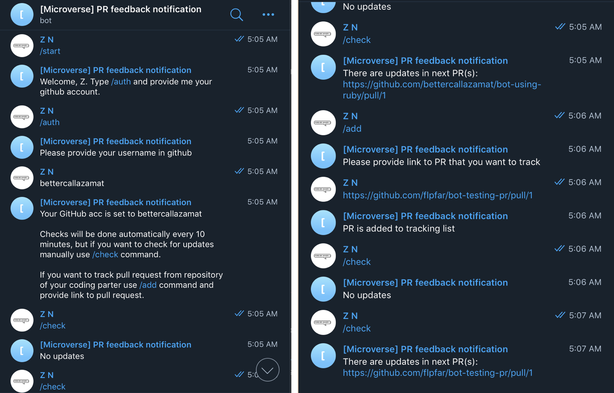

# telegram-bot-using-ruby
> This bot will notify you about new comments (feedbacks) on pull requests(PR) in your repository

## Link to telegram bot
[Check it out!](https://t.me/microverse_pr_bot)

## Build with
- Ruby
- HTTParty
- telegram/bot lib
- GitHub API
- RSpec

## Screenshot of bot

## Getting started
In order to use this Telegram Bot:

1. Open telegram find @microverse_pr_bot
2. Start a bot, it will ask you to use /auth command in which you need to provide your github username
3. Check if bot has saved your github username you can run /username command
4. Checks will be done automatically every 10 minutes, but if you want to check for updates manually use /check command. 
5. If you want to track PR from repository of your coding parter use /add command and provide link to pull request.

## Future plans
- Make bot check updates based on time of comments creating rather than checking numbers of comments(feedbacks)

## Commands available
1. /start - Starting a bot
2. /stop - Stopping a bot
3. /auth - Saves your GitHub username
4. /username - Give you username that you have provided to bot
6. /check - Checks if there are new feedbacks on your PRs

## Authors

👤 **Azamat Nuriddinov**

- Github: [@bettercallazamat](https://github.com/bettercallazamat)
- Twitter: [@azamat_nuriddin](https://twitter.com/azamat_nuriddin)
- Linkedin: [Azamat Nuriddinov](https://www.linkedin.com/in/azamat-nuriddinov-57579868)

## 🤝 Contributing

Contributions, issues, and feature requests are welcome!

Feel free to submit a new suggestion > [issues page](issues/).

## Show your support

Give a ⭐️ if you like this project!
